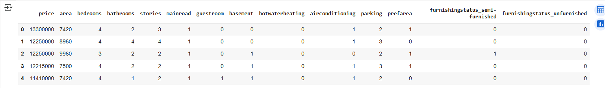
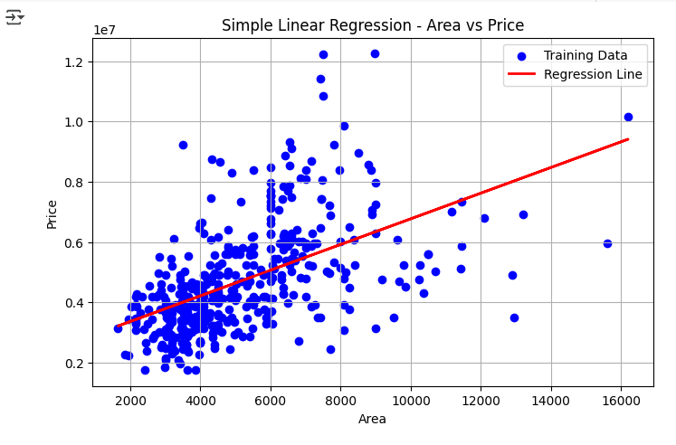
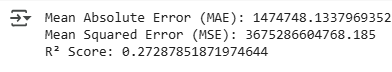
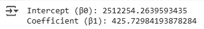
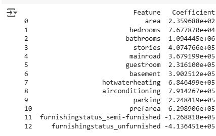
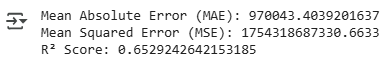
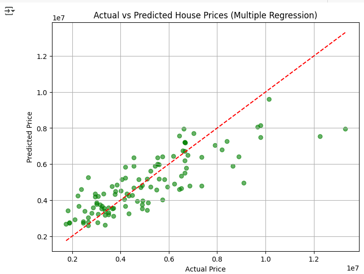
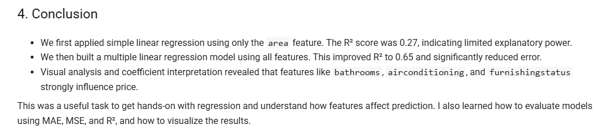

# 📈 Task 3 – Linear Regression | Elevate Labs Internship

## 📌 Objective
The goal of this task was to build and evaluate both **Simple Linear Regression** and **Multiple Linear Regression** models to predict house prices based on various features.

This helped me understand how individual features influence the output, and how model performance improves with multiple variables. I also learned how to interpret model coefficients and evaluation metrics like MAE, MSE, and R².

---

## 📁 Dataset
- [Housing Dataset – Kaggle](https://www.kaggle.com/datasets/harishkumardatalab/housing-price-prediction)

---

## 🔧 Steps Performed

- Loaded and inspected the dataset
- Cleaned and encoded categorical features:
  - Binary features (like 'yes'/'no') mapped to 0/1
  - One-hot encoding used for `furnishingstatus`
- Built a **Simple Linear Regression model** using only the `area` feature
- Visualized the regression line and calculated model coefficients:
  - Intercept (β₀): `2512254.26`
  - Coefficient for area (β₁): `425.73`
- Evaluated simple regression using MAE, MSE, and R²
- Built a **Multiple Linear Regression model** using all features
- Printed and interpreted model coefficients
- Visualized actual vs predicted prices to check model accuracy
- Evaluated model performance with MAE, MSE, and R²

---

## 📊 Key Outputs & Insights

### Simple Linear Regression (area → price)
- R² = 0.27 → area alone explains only 27% of price variation
- MAE ≈ ₹14.7L → average prediction error was high
- Coefficients:
  - Intercept β₀ = ₹25.1L
  - Area coefficient β₁ = ₹425/sq.ft.
- Model underperforms due to limited features

### Multiple Linear Regression (all features)
- R² = 0.65 → model explains 65% of price variation
- MAE ≈ ₹9.7L → improved accuracy
- Coefficients show that:
  - Bathrooms, air conditioning, and preferred area have large positive impact
  - Unfurnished homes reduce predicted price
- Visual plot showed predictions are mostly close to actuals, with some spread

---

## 📊 Screenshots

### Preprocessed Dataset

### Simple Regression
- **Regression Line (Area vs Price)**  
  

- **Evaluation Metrics**  
  

- **Model Coefficients (Simple)**  
  

### Multiple Regression
- **Coefficients Table**  
  

- **Evaluation Metrics**  
  

- **Actual vs Predicted Prices Plot**  
  

- **Final Summary Markdown**  
  

---

## ✨ Going the Extra Mile

Even though the task only required building and evaluating models, I made sure to:

- Highlight how coefficients relate to the house price
- Show understanding of both modeling and interpretation

---

## 🙋‍♀️ About Me

I'm Jaaie, an IT graduate currently reskilling through Elevate Labs' AI/ML internship.  
With a strong academic foundation, I’m learning how to apply AI/ML techniques through hands-on tasks that mimic real-world industry work. 

---

## 🔗 Submission

This project is submitted as part of the **Elevate Labs AI/ML Internship – Task 3**.

